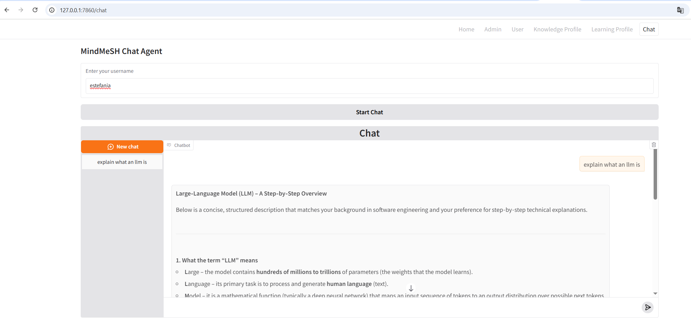
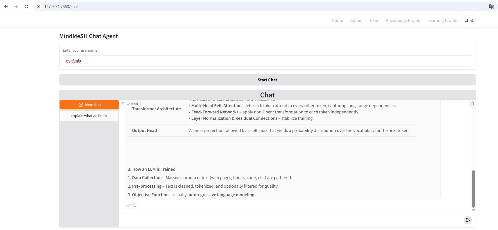

# MindMesh

## Steps to run the project

1. Create a virtual environment, run: `python -m venv .venv` 
2. Activate the virtual environment: 
   - For Windows, run: `.venv/Scripts/activate`
   - For MacOS/Linux, run: `source .venv/bin/activate`
3. Install the dependencies, run: `pip install -r requirements.txt` 
4. Create an access token from Hugging Face to get access to the repository: `openai/gpt-oss-120b`
   - You can create an access token by following the instructions [here](https://huggingface.co/docs/hub/security-tokens)
5. Set the access token as an environment variable: 
    a. For Windows, run: `$env:HF_TOKEN="<your_huggingface_api_key>"`
6. Create a file named `.env` in the root directory of the project and add the following line to it:
   `HF_TOKEN=<your_huggingface_api_key>`
7. Exit the application and reopen it to ensure the environment variable is loaded correctly.
8. Run the main application: `python -m ui.gradio.app`
9. This command will provide you with a local URL (e.g., http://127.0.0.1:7860) that you can open in your web browser to access the application.

## Steps to run a single Gradio page

1. Execute the file you want to run: `python -m <package_path>.<file_name>`
   - Include the `-m` flag to run the file as a module, which ensures that relative imports work correctly from the project root.

## Web Application Functionality

- Please note that you need to create a user account in order to test the other currently implemented functionalities.
- Then, you must create a knowledge profile by using the same username from the user account.
- Then, you must create a learning profile by using the same username from the user account.
- After creating the profiles, you can test Chat, in which you must provide a valid username that has both a knowledge profile and a learning profile. 
- Once you provide a valid username, click on "Start Chat" to initiate the chat session.

## Stop Running the Application

1. First, close the web application on the web browser.
2. Then, go to the terminal where the application is running and press `CTRL + C` to stop the application.
3. Finally, deactivate the virtual environment by running: `deactivate`

## Additional Showcase
Below are some pictures of the llm in action, which we did not include in the video:

